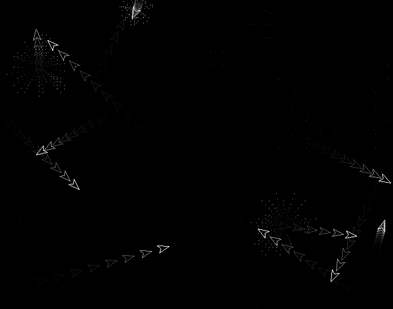



## Asteroid Madness Screensaver

### Description

Watch the asteroid ships obliterate themselves as they charge on their course, only to be deflected by the edge of the screen. Hope you enjoy. Mike.
 
### More Info
 

             |
---                |---
**Submitted On**   |2003-02-21 23:38:56
**By**             |[Fosters](https://github.com/Planet-Source-Code/PSCIndex/blob/master/ByAuthor/fosters.md)
**Level**          |Intermediate
**User Rating**    |5.0 (10 globes from 2 users)
**Compatibility**  |VB 4\.0 \(32\-bit\), VB 5\.0, VB 6\.0
**Category**       |[Graphics](https://github.com/Planet-Source-Code/PSCIndex/blob/master/ByCategory/graphics__1-46.md)
**World**          |[Visual Basic](https://github.com/Planet-Source-Code/PSCIndex/blob/master/ByWorld/visual-basic.md)
**Archive File**   |[Asteroid\_M164070942003\.zip](https://github.com/Planet-Source-Code/fosters-asteroid-madness-screensaver__1-48215/archive/master.zip)

